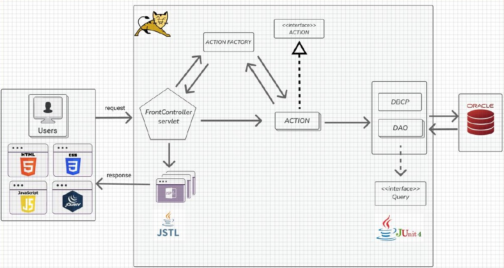
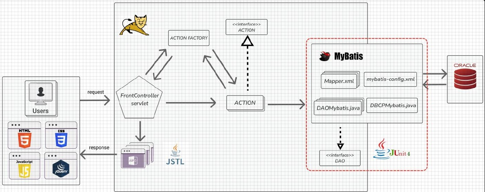
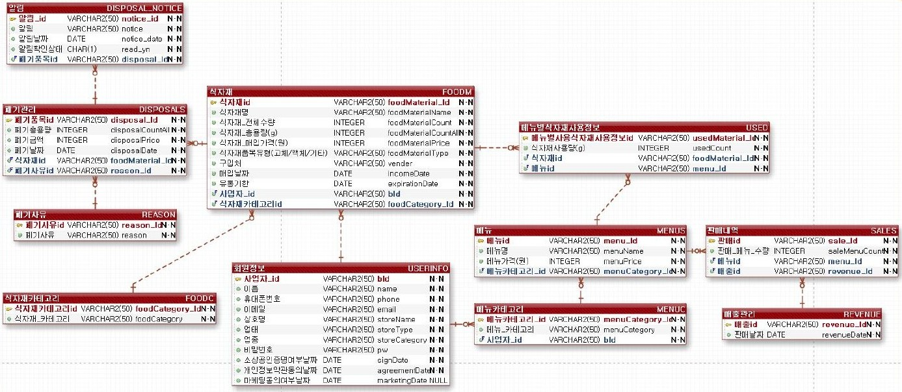

# EUM 🍽️ — 소상공인 식자재 관리 ERP

> 식자재·메뉴·판매·폐기·통계를 관리하는 웹 서비스입니다.  
> 1차 스프린트에서 Servlet/JSP 기반 MVC Model2 구조를 구현하고, 후속 리팩터링에서 화면과 요청 흐름을 유지한 채 개인 담당 식자재 추가·조회 DAO를 MyBatis로 전환했습니다.


---

## 📌 프로젝트 개요

| 항목 | 1차 스프린트 | 1차 리팩터링 |
| --- | --- | --- |
| 기간 | **2026.04.08 ~ 2026.04.30** | **2026.05.07 ~ 2026.05.12** |
| 인원 | 5명 | 4명 |
| 목표 | 요구사항을 MVC Model2 웹 서비스로 구현 | JDBC DAO를 MyBatis로 전환 |
| 데이터 접근 | JDBC · DriverManager | MyBatis · Mapper XML |
| 구조 | Front Controller · Command(Action) · JSP | URL · Action · JSP 유지 · DAO 인터페이스 도입 |
| 개인 담당 | 식자재 조회·삭제, 메뉴 조회·판매, 재고 차감 | 식자재 추가·조회 DAO 전환과 테스트 |

### 단계별 변화

```text
1차 스프린트
Servlet/JSP + Front Controller + Action + JDBC
                         ↓
1차 리팩터링
화면·요청 구조 유지 + DAO 구현을 MyBatis로 교체
```

---

## 1️⃣ 1차 스프린트 — MVC Model2 구현

### 소프트웨어 아키텍처



> 1차의 `DBCP` 클래스는 싱글톤으로 DB 연결 생성 로직을 관리했지만, `Connection`은 `DriverManager.getConnection()` 호출 시마다 생성했으므로 커넥션 풀 구현은 아닙니다.

| 계층 | 구성 요소 | 역할 |
| --- | --- | --- |
| Controller | `FrontControllerServlet` | 모든 요청의 단일 진입점 |
| Factory | `ActionFactory` | `cmd` 값에 맞는 Action 객체 선택 |
| Command | `Action` 구현체 | 요청별 업무 처리와 화면 경로 반환 |
| Persistence | DAO · DriverManager · Query | JDBC 연결, SQL 실행, 결과 매핑 |
| Model | VO | 계층 간 데이터 전달 |
| View | JSP · JSTL · JavaScript · jQuery | 화면 렌더링과 사용자 입력 처리 |

### 요청 처리 흐름

```text
/controller?cmd=foodMaterialAction
          ↓
FrontControllerServlet
          ↓
ActionFactory.getAction(cmd)
          ↓
Action.execute(request)
          ↓
DAO → JDBC(DriverManager) → Oracle
          ↓
request.setAttribute(...)
          ↓
JSP forward
```

### 개인 구현 범위

| 영역 | 구현 내용 |
| --- | --- |
| 식자재 조회 | 목록, 검색, 정렬, 페이징, 카테고리 필터 |
| 식자재 삭제 | 선택 항목과 연관 데이터 삭제 순서 처리 |
| 메뉴 조회 | 메뉴 목록·상세, 메뉴별 구성 식자재 조회 |
| 메뉴 판매 | 판매 수량 반영, 필요 식자재 계산, 부족 재고 확인, 재고 차감 |
| 검증 | DAO 단위 테스트와 DB 결과 확인 |

### 주요 구현 포인트

#### Front Controller + Command 패턴

- `/controller`가 모든 요청을 받도록 진입점을 단일화했습니다.
- `ActionFactory`가 `cmd`에 맞는 Action을 선택합니다.
- Action은 업무 처리 후 이동할 JSP 경로를 반환합니다.

#### 메뉴 판매와 재고 차감

```text
판매 요청
  → 판매 수량 입력값 확인
  → 메뉴 구성 식자재와 사용 중량 조회
  → 판매 수량을 반영한 필요 중량 계산
  → 부족 재고 확인
  → 식자재별 재고 차감
```

- 현재 재고가 충분할 때만 UPDATE가 실행되도록 조건을 적용했습니다.
- 한 품목이라도 부족하면 판매를 반영하지 않고 오류 메시지를 반환했습니다.

#### 연관 데이터를 고려한 식자재 삭제

```text
USED 삭제 → DISPOSALS 삭제 → FOODM 삭제
```

참조 관계가 있는 데이터를 먼저 정리한 후 식자재를 삭제하도록 순서를 고정했습니다.

---

## 2️⃣ 1차 리팩터링 — JDBC → MyBatis

### 리팩터링 소프트웨어 아키텍처



> 리팩터링에서는 MyBatis의 `POOLED` DataSource를 사용하고, `DBCPMybatis`에서 단일 `SqlSessionFactory`를 생성해 재사용했습니다.

### 변경 범위

| 구분 | Before: JDBC | After: MyBatis |
| --- | --- | --- |
| SQL 위치 | Java Query·DAO | Mapper XML |
| DB 처리 | Connection·PreparedStatement·ResultSet 직접 처리 | SqlSession과 Mapper statement 사용 |
| 결과 매핑 | ResultSet에서 VO 수동 생성 | `resultMap`·alias 기반 매핑 |
| 반복 코드 | 연결·예외·자원 반환이 DAO마다 반복 | 공통 설정과 Mapper로 축소 |
| 유지 영역 | URL, Action, JSP | 동일하게 유지 |

### 점진적 전환 방식

- DAO 인터페이스를 도입해 JDBC 구현과 MyBatis 구현을 분리했습니다.
- 화면과 요청 처리 구조는 유지하고 데이터 접근 계층을 중심으로 점진적으로 교체했습니다.
- 개인 담당 식자재 추가·조회 DAO부터 전환하고 테스트로 동일 결과를 확인했습니다.

### 정량적 결과

| 측정 범위 | JDBC | MyBatis | 변화 |
| --- | ---: | ---: | ---: |
| 개인 담당 식자재 DAO | 425줄 | 262줄 | **-38.4%** |
| 팀 전체 DAO | 1,661줄 | 1,049줄 | **-36.8%** |

| 검증 범위 | 결과 |
| --- | ---: |
| 개인 식자재 DAO 테스트 | **16건 · 실패 0건** |
| 팀 전체 DAO 테스트 | **62건 · 실패 0건** |

> 줄 수 감소는 성능 향상 수치가 아니라 JDBC 연결·예외·자원 반환 반복 코드가 줄어든 유지보수성 지표입니다.

---

## 🔧 트러블슈팅 — MyBatis 결과 매핑 실패

### 문제

SQL은 정상 실행됐지만 조회 결과의 `foodMaterialId`가 `null`로 반환됐습니다.

### 원인

DB 컬럼명 `foodMaterial_Id`와 Java 프로퍼티명 `foodMaterialId`가 자동으로 연결되지 않았습니다.

### 해결

```sql
SELECT foodMaterial_Id AS foodMaterialId
FROM FOODM
```

- 조회 컬럼에 Java 프로퍼티명과 같은 alias를 지정했습니다.
- Mapper XML의 매핑 기준을 정리했습니다.
- DAO 단위 테스트로 값이 정상 매핑되는지 다시 확인했습니다.

---

## 🗃️ 데이터베이스 설계



| 핵심 테이블 | 설명 |
| --- | --- |
| `USERINFO` | 사업자와 매장 정보 |
| `FOODM`, `FOODC` | 식자재와 식자재 카테고리 |
| `MENUS`, `MENUC` | 메뉴와 메뉴 카테고리 |
| `USED` | 메뉴별 식자재 사용량 |
| `SALES`, `REVENUE` | 판매 기록과 매출 |
| `DISPOSALS`, `REASON` | 폐기 기록과 폐기 사유 |
| `DISPOSAL_NOTICE` | 식자재 알림 |

---

## 🛠️ 기술 스택

| 구분 | 1차 스프린트 | 1차 리팩터링 |
| --- | --- | --- |
| Language | Java 8 | Java 8 |
| Backend | Servlet, JSP, JSTL | Servlet, JSP, JSTL |
| Architecture | MVC Model2, Front Controller, Command | 기존 구조 유지 |
| Persistence | JDBC(DriverManager) | MyBatis 3.2.3, Mapper XML |
| Frontend | HTML, CSS, JavaScript, jQuery | 기존 화면 유지 |
| Database | Oracle | Oracle |
| Server | Apache Tomcat | Apache Tomcat |
| Test / Tool | JUnit 4, Eclipse, GitHub | JUnit 4, Eclipse, GitHub |

---

## 🚀 실행 방법

이 프로젝트는 Maven·Gradle 프로젝트가 아닌 **Eclipse Dynamic Web Project**입니다.

```text
1. JDK 8과 Eclipse Enterprise Java 설치
2. Existing Projects into Workspace로 프로젝트 가져오기
3. Oracle 스키마와 샘플 데이터 준비
4. 로컬 DB 접속 정보 설정
5. Eclipse에 Tomcat 등록 후 프로젝트 배포
6. http://localhost:8080/KostaErp 접속
```

실제 DB 계정·비밀번호가 포함된 설정 파일은 공개 저장소에 커밋하지 않습니다.

---

## 📁 프로젝트 구조

```text
KostaErp
├─ src
│  ├─ com/kostaErp
│  │  ├─ model
│  │  │  ├─ DAO
│  │  │  ├─ Interface
│  │  │  └─ VO
│  │  └─ servlet
│  ├─ config
│  │  ├─ *Mapper.xml
│  │  └─ mybatis-Config.xml
│  └─ test
└─ WebContent
   ├─ css
   ├─ js
   ├─ view
   └─ WEB-INF
```

---

## 🔗 다음 단계

- [2·3차 Spring Boot 백엔드](https://github.com/y0ung-hoon2/KostaErpServer)
- [3차 React 프런트엔드](https://github.com/y0ung-hoon2/eum)
